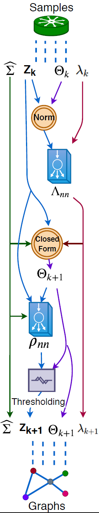

## uGLAD  
An unsupervised deep learning model to recover sparse graphs. This work proposes `uGLAD` which is a unsupervised version of a previous `GLAD` model (GLAD: Learning Sparse Graph Recovery (ICLR 2020 - [link](<https://openreview.net/forum?id=BkxpMTEtPB>)).  

Key benefits & features:  
- Solution to Graphical Lasso: A better alternative to solve the Graphical Lasso problem as
    - The neural networks of the uGLAD enable adaptive choices of the hyperparameters which leads to better performance than the existing algorithms  
     - No need to pre-specify the sparsity related regularization hyperparameters  
    - Requires less number of iterations to converge due to neural network based acceleration of the unrolled optimization algorithm (Alternating Minimization)    
    - GPU based acceleration can be leveraged  
- Glasso loss function: The loss is the logdet objective of the graphical lasso `1/M(-1*log|theta|+ <S, theta>)`, where `M=num_samples, S=input covariance matrix, theta=predicted precision matrix`.  
- Ease of usability: Matches the I/O signature of `sklearn GraphicalLassoCV`, so easy to plug-in to the existing code.  

### uGLAD architecture: Unrolled deep model  
<!--     -->

<!-- <object data="https://github.com/Harshs27/uGLAD/blob/main/.images/architecture.pdf" type="application/pdf" width="700px" height="700px">
    <embed src="https://github.com/Harshs27/uGLAD/blob/main/.images/architecture.pdf">
        
This browser does not support PDFs. Please download the PDF to view it: <a href="https://github.com/Harshs27/uGLAD/blob/main/.images/architecture.pdf">Download PDF</a>.

    </embed>
</object> -->

              

 

<!--   

   -->

## Setup  
The `setup.sh` file contains the complete procedure of creating a conda environment to run mGLAD model. run `bash setup.sh`    
In case of dependencies conflict, one can alternatively use this command `conda env create --name uGLAD --file=environment.yml`.  

## demo-uGLAD notebook  
A minimalist working example of uGLAD. It is a good entry point to understand the code structure as well as the uGLAD model.  

## Citation
If you find this method useful, kindly cite the following 2 associated papers:

- uGLAD:  

- GLAD:  
@article{shrivastava2019glad,
  title={GLAD: Learning sparse graph recovery},
  author={Shrivastava, Harsh and Chen, Xinshi and Chen, Binghong and Lan, Guanghui and Aluru, Srinvas and Liu, Han and Song, Le},
  journal={arXiv preprint arXiv:1906.00271},
  year={2019}
}
